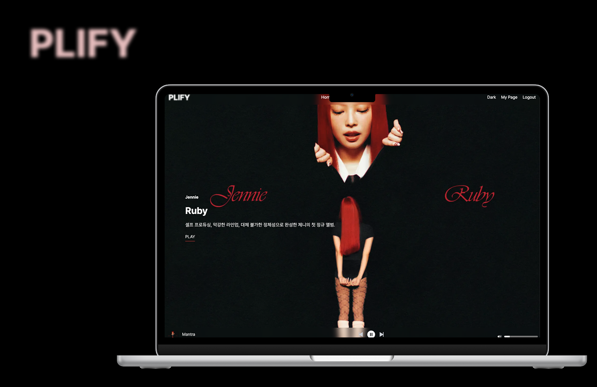
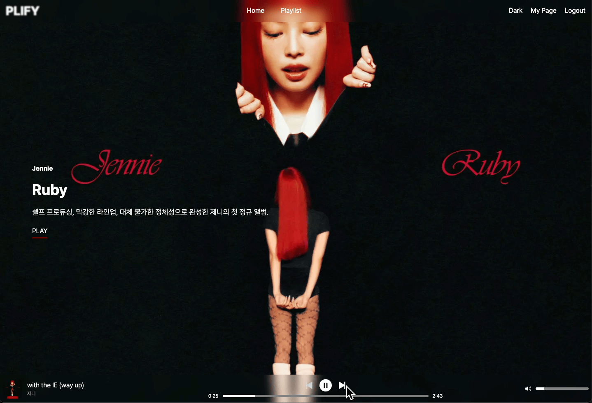

     

## 🎵 Plify : 스포티파이 플레이리스트 공유 플랫폼

### 나만 듣기 아쉬운 플레이리스트, 이제 함께 들어요!

Spotify에서 만든 나만의 플레이리스트, 혼자 듣기엔 아깝지 않으셨나요?
Plify에서 다른 사람들과 플레이리스트를 공유하고, 댓글로 소통하며 음악 취향을 나눠보세요.
새로운 음악도 발견하고, 취향이 맞는 친구도 만날 수 있어요!

### 👩🏻‍💻 간편한 Spotify 로그인

복잡한 가입 절차 없이 Spotify 계정으로 간편하게 로그인하세요.  
로그인 후 바로 Plify의 모든 기능을 편리하게 이용할 수 있습니다.

### 🎧 Spotify와 실시간 연동

Spotify 계정으로 로그인하면,  
현재 듣고 있던 음악을 그대로 Plify에서 이어서 감상할 수 있습니다.  
실시간 연동으로 더욱 편리한 음악 경험을 누려보세요!

### 🎧 플레이리스트 발견하기

매일 듣던 음악이 지겨워졌다면, 다양한 플레이리스트를 탐색해보세요.  
플레이 버튼만 누르면 바로 플레이리스트가 재생됩니다. 플레이리스트가 좋다면 댓글을 남겨보세요.

### 🚀 플레이리스트 공유하기

나만 알고 있긴 아까운 나의 플레이리스트를 공유해보세요. Spotify에서 만든 플레이리스트를 Plify에서 손쉽게 공유하세요.

## ⚒️ Tech Spec.

### 📌 Frontend

- **Framework:** Next.js 15
- **Language:** TypeScript
- **Styling:** Tailwind CSS
- **State Management:** Zustand
- **Data Fetching:** React Query
- **Package Manager:** pnpm

### 📌 Backend

- **Framework:** NestJS
- **Language:** TypeScript

### 📌 외부 서비스

- **Spotify API**
